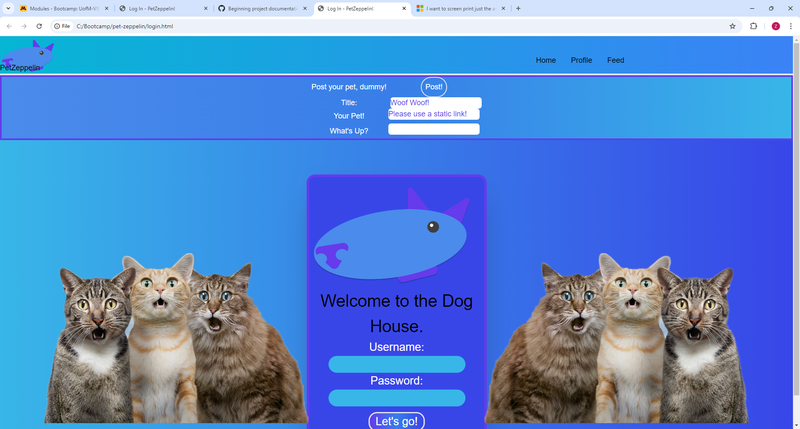

#   Pet Zeppelin

Pet Zeppelin is a blog platform for pet owners, allowing our pet's humans to share images and stories of their pets. Users will be able to create a password protected profile, and make blog posts that will include sharing image URLs. Blog posts will be pulled from local storage and presented to the user.

#   Gaze Upon It's Glory

#   Description

When opening the initial page, the user will be presented with a login screen. Upon entering a username and password, the site will check for an existing user by that name. If the username exists, the site will confirm that the password is correct. If the username is unique, it will create a new "account" with that username and password.  After logging in, the user will be able to create blog posts that will contain a title, image, and post content, as well as read previous blog posts. 

#   Development

Pet Zeppelin uses HTML, Tailwind CSS, and Javascript. It utilizes the user's local storage for storing user and post information. It should be compatible with all modern, mainstream browsers without any outside dependencies.

#   Content

Pet Zeppelin begins with an exisiting database of posts and adorable photographs of beloved pets. All user-generated content is stored as .JSON files, and image links utilize outside URLs.

#   File Details

#   License

Pet Zepplin is released under the MIT license.