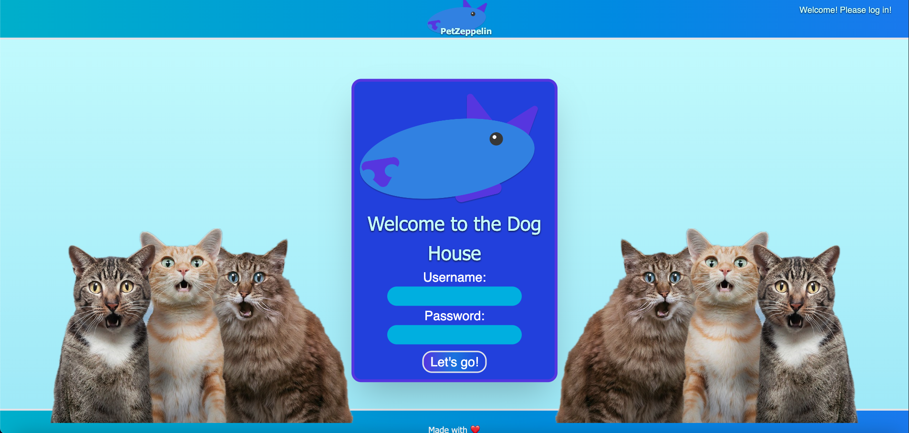

#   Table of Contents
1.  [Introduction](#Pet-Zeppelin)
2.  [Screenshots](#screenshots)
3.  [Application Description](#description)
4.  [Development Tools](#development-tools)
5.  [Application Content](#content)
6.  [File Details](#file-details)
7.  [License](#license)
8.  [Credits](#credits)

#   Pet Zeppelin

Pet Zeppelin is a blog platform for pet owners, allowing our pet's humans to share images and stories of their pets. Users will be able to create a password protected profile, and make blog posts that will include sharing image URLs. Blog posts will be pulled from local storage and presented to the user.

Pet Zeppelin can be visited at -

https://jsparrowio.github.io/pet-zeppelin/

And the GitHub is at -

https://github.com/jsparrowio/pet-zeppelin

#   Screenshots

#   Description

When opening the initial page, the user will be presented with a login screen. Upon entering a username and password, the site will check for an existing user by that name. If the username exists, the site will confirm that the password is correct. If the username is unique, it will create a new "account" with that username and password.  After logging in, the user will be able to create blog posts that will contain a title, image, and post content, as well as read previous blog posts. 

#   Development Tools

Pet Zeppelin uses HTML, Tailwind CSS, and Javascript. It utilizes the user's local storage for storing user and post information. It should be compatible with all modern, mainstream browsers without any outside dependencies.

#   Content

Pet Zeppelin begins with an exisiting database of posts and adorable photographs of beloved pets. All user-generated content is stored as .JSON files, and image links utilize outside URLs.

#   File Details

Index.html exists solely as a redirect page. Upon loading, it executes a script that will direct the user to create an account or to their profile, as appropriate. It uses index.js.

Global.js contains the only global variable, and global functions for use in other scripts.

Proilepage.html is paired with profile.js to function as the "introductory" page for the soon-to-be pet blogger.

Blogpage.html and blog.js handle the posting and storage functions, allow the user to both post and read blog entries.

Tailwind.config contains resources for Tailwind CSS.

Dummyposts.JSON is the database of prepopulated posts.

#   License

Pet Zepplin is released under the MIT license.

#   Credits

Pet Zeppelin is brought to you by Josh Garrett, Lucas Hallman, Matt Oberdalhoff, Zachary LaCore, and Zachary Lynch.